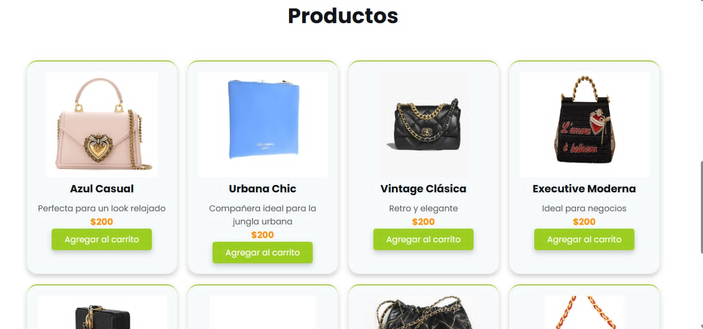

# Proyecto tienda bolsas

Proyecto web de una tienda de bolsas desarrollado con HTML, CSS, JavaScript y Node.js con Express.

## Vista previa

### Página principal


### Sección de productos



## Tecnologías utilizadas

- HTML
- CSS
- JavaScript
- Node.js
- Express

## Ejecución del proyecto

Entrar a la carpeta del servidor:

```bash
cd server
npm install
npm start
